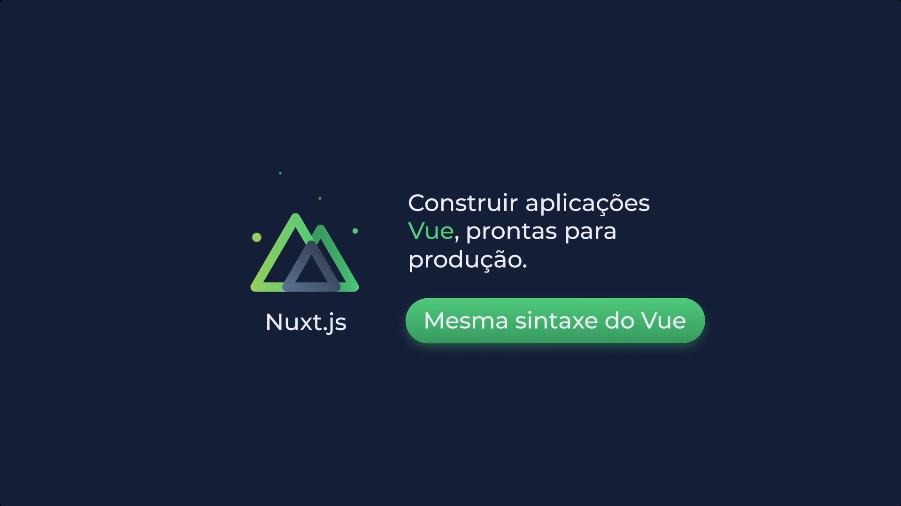

# nuxt-ts
Repositório criado para desenvolvimento do projeto apresentado no curso 'Escalando Vue com Nuxt', ministrado pela plataforma Cataline.



## Configurações para compilação

```bash
# instalar dependências
$ yarn install

# servidor com recarga rápida em localhost:3000
$ yarn dev

# compilação para produção e iniciar servidor
$ yarn build
$ yarn start

# gerar projeto estático
$ yarn generate
```

Para obter uma explicação detalhada sobre como as coisas funcionam, acesse [Documentação Nuxt.js](https://nuxtjs.org).
